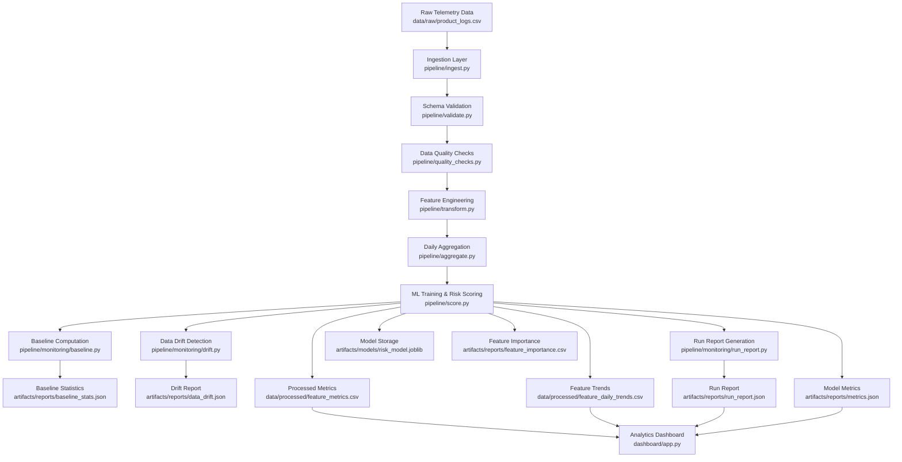
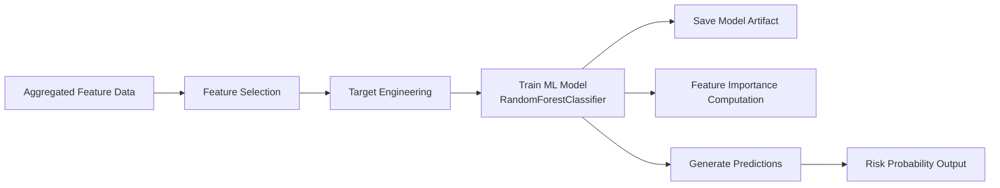
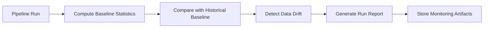

# Product Feature Quality & Performance Analytics Platform

A production-style analytics and machine learning system for monitoring feature-level reliability, detecting performance regressions, and proactively identifying operational risk in large-scale consumer platforms.

This project simulates how modern technology companies (Netflix, Uber, Amazon, Meta) build internal analytics and ML pipelines to detect quality degradation before it impacts users.

The system implements a complete end-to-end analytics architecture including:

- Data ingestion and validation
- Feature engineering and aggregation
- Machine learning risk prediction
- Model artifact storage
- Data quality monitoring and drift detection
- Run reporting and observability
- Dashboard-based decision interface

---

# Dashboard Preview


---

# Problem Context

Large-scale consumer platforms operate hundreds of product features simultaneously.

Small degradations in latency, crash rate, or user experience often go unnoticed until they affect millions of users.

Engineering teams require systems that can:

- Detect early warning signals
- Quantify feature-level reliability risk
- Prioritize engineering effort based on impact
- Monitor data quality and pipeline health
- Provide actionable insights through dashboards

This project simulates how production analytics systems solve these problems.

---

# System Architecture

This diagram represents the complete execution and data flow architecture.



---

# Pipeline Architecture Overview

Pipeline execution flow:

```
run_pipeline.py
  ├ ingest.py
  ├ validate.py
  ├ quality_checks.py
  ├ transform.py
  ├ aggregate.py
  ├ score.py
  ├ monitoring/baseline.py
  ├ monitoring/drift.py
  └ monitoring/run_report.py
```

Design principles:

- Stateless execution
- Idempotent batch processing
- Modular pipeline stages
- Observable and auditable execution
- Extensible architecture

---

# Data Model Architecture

Fact table:

```
fact_feature_metrics
```

Grain:

```
one row per feature per day
```

Contains:

- latency metrics
- crash rate
- feedback score
- usage volume
- predicted risk probability

Dimension table:

```
dim_feature_metadata
```

Contains:

- feature ownership
- lifecycle stage
- feature metadata

---

# Machine Learning Architecture



Artifacts generated:

```
artifacts/models/risk_model.joblib
artifacts/reports/metrics.json
artifacts/reports/feature_importance.csv
```

Output:

```
risk_probability per feature per day
```

---

# Monitoring and Observability Architecture



Generated monitoring artifacts:

```
baseline_stats.json
data_drift.json
run_report.json
metrics.json
```

This enables production-grade observability.

---

# Core Capabilities

## Feature Risk Modeling

- Predicts degradation probability
- Identifies unstable product features
- Enables proactive engineering intervention

## Data Quality Monitoring

- Schema validation
- Missing value detection
- Anomaly detection

## Drift Detection

- Detects statistical changes in incoming data
- Protects model reliability

## Observability

- Pipeline run reports
- Artifact tracking
- Monitoring metrics

## Dashboard Analytics

- Feature-level reliability visualization
- Risk monitoring interface
- Decision support for engineering teams

---

# Example Insights Generated

Examples include:

- Features with rising latency flagged as high risk
- Reliability degradation trends
- Feature importance analysis
- Pipeline health monitoring

---

# Project Structure

```
product-feature-quality-analytics/

├ assets/
│   └ dashboard_demo.gif
│
├ dashboard/
│   └ app.py
│
├ data/
│   ├ raw/
│   │   └ product_logs.csv
│   └ processed/
│       ├ feature_metrics.csv
│       └ feature_daily_trends.csv
│
├ pipeline/
│   ├ ingest.py
│   ├ validate.py
│   ├ quality_checks.py
│   ├ transform.py
│   ├ aggregate.py
│   ├ score.py
│   ├ run_pipeline.py
│   └ monitoring/
│       ├ baseline.py
│       ├ drift.py
│       └ run_report.py
│
├ artifacts/
│   ├ models/
│   │   └ risk_model.joblib
│   └ reports/
│       ├ baseline_stats.json
│       ├ data_drift.json
│       ├ metrics.json
│       ├ feature_importance.csv
│       └ run_report.json
│
├ logs/
│   └ pipeline.log
│
├ README.md
├ requirements.txt
└ .gitignore
```

---

# Technology Stack

Languages:

- Python
- SQL

Data Processing:

- Pandas
- NumPy

Machine Learning:

- Scikit-learn

Visualization:

- Streamlit
- Matplotlib

Monitoring:

- Custom monitoring pipeline
- Drift detection
- Logging and reporting

---

# Running the Pipeline

Install dependencies:

```
pip install -r requirements.txt
```

Run pipeline:

```
python pipeline/run_pipeline.py
```

Run dashboard:

```
streamlit run dashboard/app.py
```

---

# Production Design Principles Demonstrated

This project demonstrates real-world production ML system design:

- Modular pipeline architecture
- Model artifact persistence
- Data versioning
- Drift detection
- Monitoring and observability
- Idempotent pipeline execution
- Dashboard-based analytics

---

# Phase 6: Production Readiness (Planned Implementation)

Upcoming additions:

- tests/
- CI/CD pipeline integration
- Automated retraining
- Docker containerization
- Makefile automation
- Cloud deployment (AWS / GCP)

---

# Maintainer

Durga Sri  
AI / Data Engineering Portfolio Project

GitHub:  
https://github.com/durgasri-dotcom

---

# Summary

This project demonstrates a complete production-style analytics and machine learning platform including:

- Data ingestion and processing
- Machine learning risk modeling
- Monitoring and observability
- Artifact management
- Dashboard visualization

This architecture reflects real-world systems used by companies like Netflix, Uber, Amazon, and Meta.
