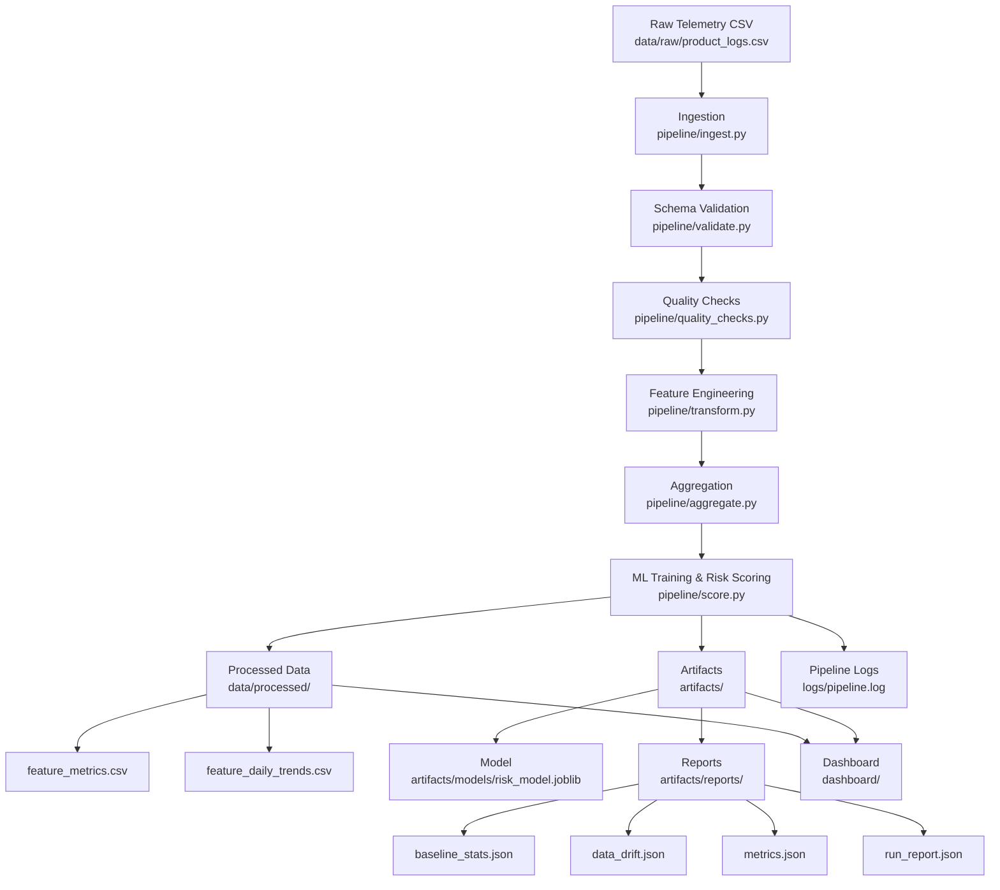

# Product Feature Quality & Performance Analytics

An analytics and machine learning system for monitoring feature-level reliability, performance trends, and proactive risk detection in large-scale consumer products.
This project demonstrates how telementry data and applied ML can be used to detect early performance regressions, quantify opereational risk, and prioritize engineering effort before user experience degrades at scale.

## Dashboard Preview


## Problem Context

Modern consumer platforms operate hundreds of product features simultaneously.
Small regressions in latency, stability, or user experience often go unnoticed until they impact a large user base.
Engineering and product teams need a way to:

- Detect early warning signals
- Understand which features are most at risk
- Prioritize mitigation based on both technical risk and user impact
- This project simulates that decision-making process using synthetic telemetry data and a production-style analytics pipeline.

## What This System Does

The system ingests feature-level telemetry and produces actionable insights through:

- Predictive risk modeling
- Time-series performance analysis
- Impact-based prioritization
- An executive-facing analytics dashboard
  The goal is not to surface raw metrics, but to support clear, defensible decisions.

## Core Capabilities

### Feature-Level Risk Modeling

- Estimates the probability of quality degradation per feature
- Uses operational signals such as latency, crash rate, and user feedback
- Designed to augment engineering judgment rather than replace it

### Time-Series Performance Analysis

- Tracks trends in latency and user experience over time
- Identifies early divergence patterns that often precede failures

### Impact-Based Prioritization

- Combines predicted risk with feature usage volume
- Produces an Impact Score to rank features by potential user harm
- Helps teams to focus effort where it matters most

### Decision-Oriented Dashboard

- Clean, executive-friendly interface built with Streamlit
- Automated insight annotations instead of raw chart inspection
- Designed for product managers, engineering leads, and reliability teams

## System Architecture

### Repository Structure

```text
data/

  raw/                # synthetic feature telemetry
  processed/           # pipeline outputs used by dashboard

pipeline/

  run_pipeline.py      # orchestration entry point

  ingest.py            # ingestion layer

  validate.py          # schema validation

  quality_checks.py    # data quality checks

  transform.py         # feature engineering

  aggregate.py         # daily aggregation

  score.py             # ML training + scoring

  monitoring/

    baseline.py        # baseline computation + persistence

    drift.py           # drift detection + persistence

    run_report.py      # run report persistence

    history.py         # run history tracking (Phase 6)

config/

  config.yaml          # config-driven execution

artifacts/

  models/              # trained model artifacts (optional to ignore in git)

  reports/             # metrics, drift, run reports

  history/             # run history log

logs/

  pipeline.log         # execution logs

dashboard/

  app.py               # Streamlit dashboard
```



## Data Modeling & Warehouse Design

This project follows a star-schema inspired modeling approach to support scalable analytics and structured querying.

### Fact Table — fact_feature_metrics

- Grain: One row per feature per day
- Stores latency, crash rate, feedback signals, usage metrics, and predicted risk
- Enables time-series window functions and rolling metric analysis

### Dimension Table — dim_feature_metadata

- Stores descriptive feature attributes (owner team, lifecycle stage, release metadata)
- Enables slicing risk and performance by organizational or lifecycle dimensions

### Analytical SQL Patterns

Example rolling latency computation:

```sql
SELECT
    feature_id,
    event_date,
    AVG(latency_ms) OVER (
        PARTITION BY feature_id
        ORDER BY event_date
        ROWS BETWEEN 6 PRECEDING AND CURRENT ROW
    ) AS rolling_7d_latency
FROM fact_feature_metrics;
```

## Pipeline Orchestration

The system implements a modular, production-style data pipeline with clearly separated execution layers:

- Ingestion Layer — loads raw telemetry data
- Validation Layer — enforces schema consistency and data quality checks
- Feature Engineering Layer — computes derived metrics and quality signals
- Aggregation Layer — produces daily feature-level aggregates
- ML Scoring Layer — generates predicted risk probabilities

The pipeline is orchestrated through a single execution entry point (`run_pipeline.py`) and is designed to be:

- Stateless
- Idempotent
- Batch-execution ready
- Easily extendable to distributed processing frameworks (e.g., Spark)

This structure mirrors real-world analytics engineering systems rather than notebook-based experimentation.

## Example Insights Produced

- Increasing latency combined with declining feedback indicates early user experience degradation
- High-risk, high-usage features are flagged for immediate investigation
- Low-risk features remain under passive monitoring without unnecessary escalation

## Technology Stack

```markdown
### Core Languages

- Python
- SQL

### Data Processing

- Pandas
- NumPy

### Machine Learning

- Scikit-learn

### Visualization

- Matplotlib
- Streamlit
```

## Running the Project Locally

- pip install -r requirements.txt
- streamlit run dashboard/app.py

## Design Philosophy

Prioritize decision support over visualization complexity
Use machine learning pragmatically, not as a black box
Optimize for clarity, reproducibility, and explainability
Reflect how analytics is actually used in production environments

## Potential Extensions

- Real-time data ingestion
- Automated anomaly detection
- Alerting integrations (Slack, PagerDuty)
- Deployment and incident annotations
- Feature comparison and cohort analysis

## Maintainer

Durga Sri  
Portfolio project demonstrating applied analytics, responsible machine learning,
and product-focused decision systems.

## Summary

This project showcases how analytics and manchine learning can be applied to real operational problems, emphasising interpretability, impact-aware prioritisation, and actionable insights over model complexity
